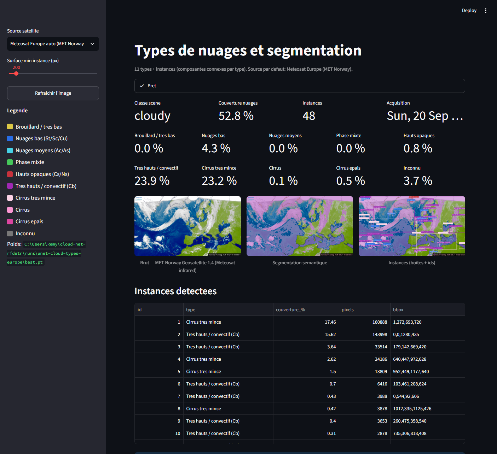
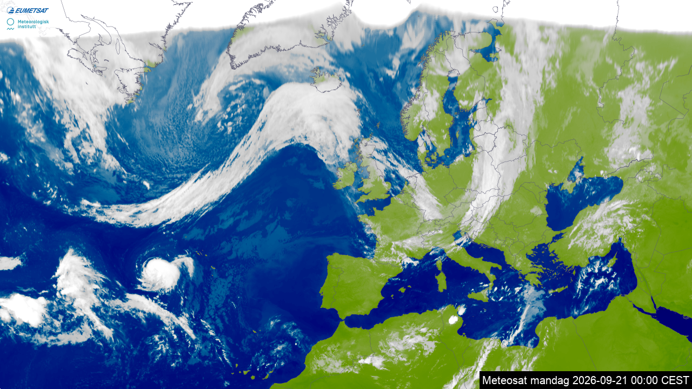
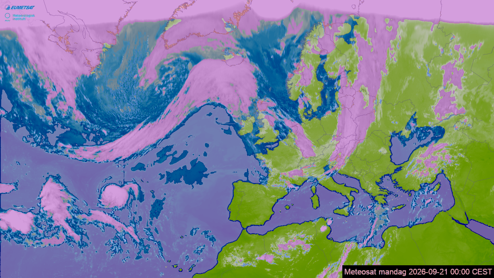
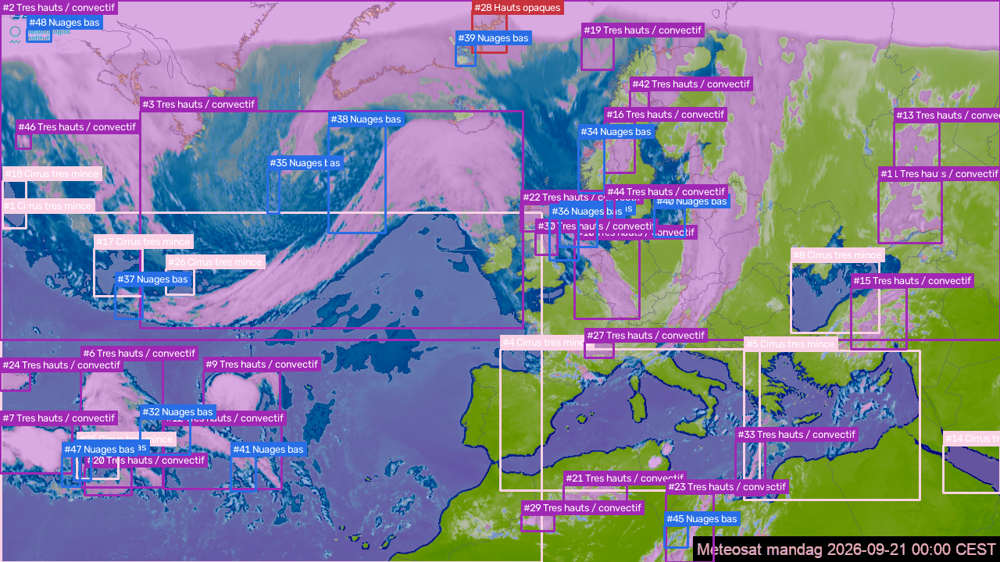

# U-Net Cloud Classification and Segmentation RT

Near-real-time cloud type classification and semantic segmentation on **Meteosat Europe** and **GOES-19**.

A compact U-Net is trained on official GOES-19 products (CMI truecolor, ACTP phase, COD optical depth, ACHA height), then fine-tuned on [MET Norway](https://api.met.no/weatherapi/geosatellite/1.4/documentation) Meteosat Europe imagery. Instance boxes are connected components per class, not a separate object detector.

## Do you need this?

**Mostly for Europe.** The free live APIs used here do **not** return cloud types. On GOES, NOAA already publishes the same information, usually better.

| Region | What the public API gives | What the model adds |
|---|---|---|
| **Europe** (MET Norway geosatellite 1.4, CIRA SLIDER) | A PNG only (visible or infrared). No phase, height, optical depth, or type. | A type map + instances from that picture. |
| **GOES-19 CONUS** (NOAA AWS) | Official L2: **ACTP** (phase), **COD** (optical depth), **ACHA** (height). | Little. The U-Net is a student of those products from RGB only. Prefer the NetCDFs if you need accuracy. |

Official Meteosat cloud types exist (**NWC SAF Cloud Type**) but are **not** in the MET Norway API (EUMETSAT / NWC SAF access). Without that, this model is a visualization stand-in, not new meteorology.

Scene class (clear / partly / cloudy) is just the mask fraction. Instances are connected components. Neither is a new retrieval.

If the goal is scientific GOES analysis, skip this repo and read ACTP + COD + ACHA. If the goal is a live Europe overlay from a free image API, this is the part that is not already provided.

<p align="center">
  
</p>

## Cloud types

| Class | Meaning |
|---|---|
| Fog / very low | Cloud top below 1 km |
| Low | St / Sc / Cu |
| Mid | Ac / As |
| Mixed phase | Water and ice |
| High opaque | Cs / Ns |
| Very high / convective | Cb |
| Cirrus (very thin / thin / thick) | Ice, split by optical depth |
| Clear / unknown | Clear sky or failed retrieval |

This is an altitude and phase taxonomy derived from GOES/Meteosat products, not the full WMO cloud atlas (shape is not labeled).

<p align="center">
  
  
  
</p>

## Resolution

**95-Cloud** is Landsat-8 at **30 m** (384×384 patches, ~11.5 km) with a multi-day revisit. Geostationary live imagery (Meteosat / GOES) is **0.5–2 km** every **2.5–15 min**. No public satellite provides both.

A binary RF-DETR-Seg trained on 38/95-Cloud does not transfer to geostationary RGB because of the domain gap. That pipeline remains in the repository for reference only.

## Install

```bash
git clone https://github.com/Thorfy/unet-cloud-classification-segmentation-rt.git
cd unet-cloud-classification-segmentation-rt
python -m venv .venv
```

Windows:

```powershell
.\.venv\Scripts\Activate.ps1
pip install -r requirements.txt
```

Linux / macOS:

```bash
source .venv/bin/activate
pip install -r requirements.txt
```

Optional CUDA build of PyTorch:

```bash
pip install torch torchvision --index-url https://download.pytorch.org/whl/cu128
```

## Dashboard

```bash
streamlit run app/streamlit_app.py
```

Default source is Meteosat Europe (visible by day, infrared at night). Checkpoints are loaded from `runs/unet-cloud-types-europe/best.pt` when present. Weights are not stored in Git.

| Source | Stream | Cadence |
|---|---|---|
| `europe` | MET Norway Meteosat Europe, visible / IR auto | ~15 min |
| `europe-visible` | MET Norway visible | ~15 min |
| `europe-ir` | MET Norway infrared | ~15 min |
| `meteosat-europe` | CIRA SLIDER GeoColor, Europe crop | variable |
| `meteosat-disk` | CIRA SLIDER GeoColor disk | ~15 min |
| `goes-19-cmi` | NOAA GOES-19 ABI CMI CONUS | ~5–10 min |
| `goes-19` | CIRA SLIDER GOES-19 GeoColor | ~10 min |
| `goes-19-star` | NOAA STAR GeoColor full disk | ~10 min |

## Training

Public GOES-19 pairs from NOAA AWS (MCMIP, ACTP, COD, ACHA):

```bash
python scripts/download_goes_types.py --max-scenes 24 --days 10
python -c "from src.ingest.goes_aws import download_acha_for_existing; print(len(download_acha_for_existing()))"
python scripts/prepare_goes_seg.py
python scripts/train_cloud_types.py --epochs 20 --batch-size 8
python scripts/finetune_europe.py --max-images 36 --epochs 10
```

| Checkpoint | Domain |
|---|---|
| `runs/unet-cloud-types/best.pt` | GOES CONUS |
| `runs/unet-cloud-types-europe/best.pt` | Meteosat Europe fine-tune |

## Legacy pipeline (38-Cloud / 95-Cloud + RF-DETR)

```bash
python scripts/download_datasets.py
python scripts/prepare_coco.py --max-train 0
python scripts/train_rfdetr.py --epochs 20
```

Datasets: [38-Cloud](https://github.com/SorourMo/38-Cloud-A-Cloud-Segmentation-Dataset), [95-Cloud](https://github.com/SorourMo/95-Cloud-An-Extension-to-38-Cloud-Dataset). Optional Kaggle token at `%USERPROFILE%\.kaggle\kaggle.json` (Windows) or `~/.kaggle/kaggle.json`. Hugging Face mirrors: `jaygala223/38-cloud-dataset`, `jaygala223/95-cloud-train-only-v1`.

## Layout

```
app/streamlit_app.py    live dashboard
src/unet.py             U-Net
src/cloud_types.py      11-class taxonomy
src/infer_types.py      inference
src/instances.py        connected-component instances
src/ingest/             MET Norway, SLIDER, GOES AWS, STAR
scripts/                download, prepare, train, fine-tune
docs/screenshots/       dashboard captures
data/                   local datasets (gitignored)
runs/                   checkpoints (gitignored)
```

## Data licenses

- MET Norway live imagery: [api.met.no](https://api.met.no/)
- GOES-19 L2: NOAA, public domain
- 38/95-Cloud: see the SorourMo repositories
- CIRA SLIDER: CIRA / RAMMB terms
